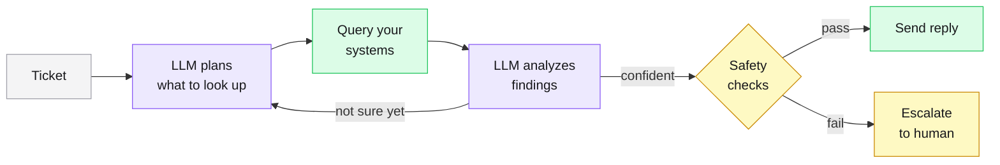

# Ticketless

An open-source support agent that actually resolves tickets instead of deflecting them.

Most support tools reply with canned answers. Ticketless connects to your database, your billing system, your logs, looks up the customer's actual data, figures out what went wrong, and writes a reply that solves the problem. If it's not sure, it hands off to a human with all the context attached.

It works with whatever stack you already have. Bring your own ticketing system, database, and LLM.

---

## How it works

When a ticket comes in, Ticketless asks an LLM (Claude, GPT-4o, or a local model) to figure out what to investigate. The LLM picks which tools to call and what arguments to pass. Ticketless runs those queries against your real systems, feeds the results back to the LLM, and asks it to diagnose the problem. If it's confident enough, it writes a reply and sends it. If not, it escalates with everything it found so the human doesn't start from scratch.

Three LLM calls per ticket: one to plan, one to analyze, one to write the reply.



The LLM decides *what* to look up. The framework does the looking. The LLM never touches your database directly, never runs code, and never sends a reply without passing safety checks. All queries are parameterized, read-only, and restricted to tables you allow.

---

## Quick start

```bash
npm install ticketless
```

Try it without an API key (uses a mock LLM):

```bash
npx tsx examples/basic-usage.ts
```

Try it with a real LLM:

```bash
export ANTHROPIC_API_KEY=sk-ant-...
npx ticketless demo
```

This runs four sample tickets against a fake SaaS dataset so you can see the agent investigate and resolve them in your terminal.

Start the server:

```bash
export ANTHROPIC_API_KEY=sk-ant-...
npx ticketless
```

Dashboard at `http://localhost:3100/dashboard`.

## Setting it up

The idea is you configure everything in one place and Ticketless wires it up:

```typescript
import {
  Agent, TicketlessServer, ConfidenceGate, FileAuditLog,
  buildLLM, buildSources, buildTools, buildEscalationRules,
} from "ticketless";

const llm = buildLLM({ provider: "claude", apiKey: process.env.ANTHROPIC_API_KEY! });

const sources = buildSources([
  { type: "zendesk", subdomain: "mycompany", email: "agent@co.com", apiToken: "..." },
]);

const tools = buildTools([
  { type: "postgres", connectionString: process.env.DATABASE_URL!, allowedTables: ["users", "orders"] },
  { type: "stripe", apiKey: process.env.STRIPE_SECRET_KEY! },
]);

const agent = new Agent(llm, new FileAuditLog("./data/audit.jsonl"), new ConfidenceGate(0.8), {
  confidenceThreshold: 0.8,
  maxToolCalls: 10,
  maxInvestigationRounds: 3,
  escalationRules: buildEscalationRules(),
});

for (const tool of tools) agent.registerTool(tool);

const server = new TicketlessServer({
  port: 3100,
  agent,
  audit: agent.audit,
  sources,
  async: true,
  reviewMode: true,        // human approves everything at first
  pollIntervalMs: 30_000,  // check for new tickets every 30s
});

server.start();
```

There's a fully commented version in [`examples/startup-setup.ts`](examples/startup-setup.ts).

## Supported providers

### Ticket sources

| Provider | Config |
|----------|--------|
| Zendesk | `{ type: "zendesk", subdomain, email, apiToken }` |
| Intercom | `{ type: "intercom", accessToken }` |
| Freshdesk | `{ type: "freshdesk", domain, apiKey }` |
| Webhook | `{ type: "webhook", port }` |

### LLM providers

| Provider | Config | Notes |
|----------|--------|-------|
| Claude | `{ provider: "claude", apiKey }` | Best results in our testing |
| OpenAI | `{ provider: "openai", apiKey }` | Works with any compatible API via `baseUrl` (Groq, Together, vLLM) |
| Ollama | `{ provider: "ollama", model }` | Local models, no API key needed |

### Data source tools

| Tool | What the agent can do with it |
|------|-------------------------------|
| Postgres | Query tables with parameterized WHERE clauses. Auto-discovers your schema on startup. |
| MySQL | Same as Postgres. Requires `mysql2` as a peer dep. |
| Stripe | Look up customers, subscriptions, invoices, charges, payment methods. |
| HTTP API | Call any REST API. You define the endpoints declaratively. |

### Custom tools

If you need the agent to query something we don't have a built-in adapter for, you write a tool:

```typescript
import type { Tool, ToolDefinition } from "ticketless";

class FeatureFlagTool implements Tool {
  readonly definition: ToolDefinition = {
    name: "check_flags",
    description: "Check which feature flags are enabled for a user",
    parameters: {
      userId: { type: "string", description: "User ID", required: true },
    },
  };

  async execute(args: Record<string, unknown>) {
    return flagService.getFlags(String(args.userId));
  }
}

agent.registerTool(new FeatureFlagTool());
```

The `description` is what the LLM reads to decide when to use the tool. Write it like you'd explain it to a new teammate.

## Safety

The LLM assigns itself a confidence score, but we don't trust it blindly. Before any reply goes out, the framework checks the score against what actually happened during investigation:

| Situation | What happens |
|-----------|--------------|
| LLM says 95% confident but called zero tools | Capped to 40% |
| Every tool call returned an error | Capped to 30% |
| Tools ran but found nothing | Capped to 35% |
| LLM gave an empty answer | Capped to 30% |
| Very high confidence with only one tool call | 10% penalty |
| Ticket mentions "refund", "legal", etc. | Always escalates regardless of confidence |
| Custom business rules (e.g., enterprise customers) | Always escalates |

This stops the worst failure mode: the model confidently sending a wrong answer when it didn't actually find anything.

## Human review

You can start in review mode where every escalated ticket goes to a queue. Humans can approve the agent's draft, edit it before sending, or reject it entirely. Over time, as you trust the agent more, you raise the confidence threshold and let more through automatically.

```bash
GET  /api/review                                      # see the queue
POST /api/review/approve  { "ticketId": "..." }       # send as-is
POST /api/review/approve  { "ticketId": "...", "editedReply": "..." }
POST /api/review/reject   { "ticketId": "...", "reason": "..." }
```

## API

| Endpoint | Method | What it does |
|----------|--------|-------------|
| `/api/ticket` | POST | Submit a ticket |
| `/api/ticket/status` | GET | Check processing status (for async mode) |
| `/api/audit` | GET | Full audit trail, optionally filtered by ticket |
| `/api/resolution` | GET | Resolution details for a ticket |
| `/api/review` | GET | Review queue |
| `/api/review/approve` | POST | Approve a review item |
| `/api/review/reject` | POST | Reject a review item |
| `/api/stats` | GET | Aggregate stats |
| `/health` | GET | Health check |
| `/dashboard` | GET | Web UI |

All endpoints support Bearer token auth if you set an API key.

## Configuration

| Variable | Default | |
|----------|---------|---|
| `TICKETLESS_LLM_PROVIDER` | `claude` | `claude`, `openai`, or `ollama` |
| `TICKETLESS_MODEL` | `claude-sonnet-4-6` | Model to use |
| `TICKETLESS_PORT` | `3100` | Server port |
| `TICKETLESS_CONFIDENCE_THRESHOLD` | `0.75` | Minimum confidence to auto-reply |
| `ANTHROPIC_API_KEY` | | Required for Claude |
| `OPENAI_API_KEY` | | Required for OpenAI |
| `DATABASE_URL` | | Postgres connection string |

## Docker

```bash
docker build -t ticketless .
docker run -p 3100:3100 -e ANTHROPIC_API_KEY=sk-ant-... ticketless
```

## Project structure

```
src/
├── core/
│   ├── agent.ts              # The investigation loop
│   ├── confidence.ts         # Validates confidence against evidence
│   ├── server.ts             # HTTP server, API routes, dashboard
│   ├── queue.ts              # Async ticket processing
│   ├── review.ts             # Human review queue
│   ├── gate.ts               # Confidence + keyword checks
│   ├── config.ts             # Config builders for all providers
│   ├── validator.ts          # Input validation
│   ├── events.ts             # Typed event bus
│   ├── errors.ts             # Error types
│   ├── audit.ts              # In-memory audit log
│   ├── audit-persistent.ts   # File-backed audit log
│   ├── prompts.ts            # Prompt templates
│   └── interfaces.ts         # Tool, LLMProvider, TicketSource contracts
├── adapters/
│   ├── tools/                # postgres, mysql, stripe, http-api
│   ├── llm/                  # claude, openai, ollama
│   └── sources/              # zendesk, intercom, freshdesk, webhook
├── demo/                     # Demo mode with sample data
├── dashboard/                # Web UI
└── e2e/                      # End-to-end tests
```

## Tests

117 tests covering the agent loop, confidence grounding, safety gates, review queue, async processing, HTTP API, input validation, and full end-to-end flows through the server.

## Contributing

See [CONTRIBUTING.md](CONTRIBUTING.md).

Adapters are the easiest way to contribute. Some ideas: Jira Service Management, HubSpot, Linear, Datadog, CloudWatch, Sentry, Slack notifications.

## License

MIT
